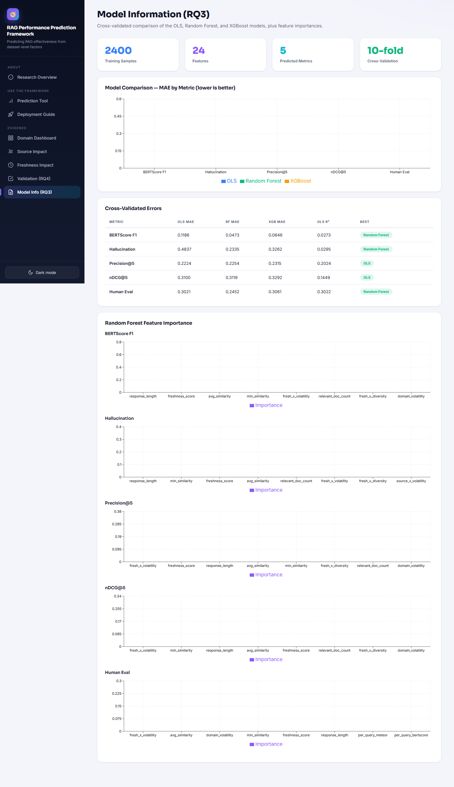
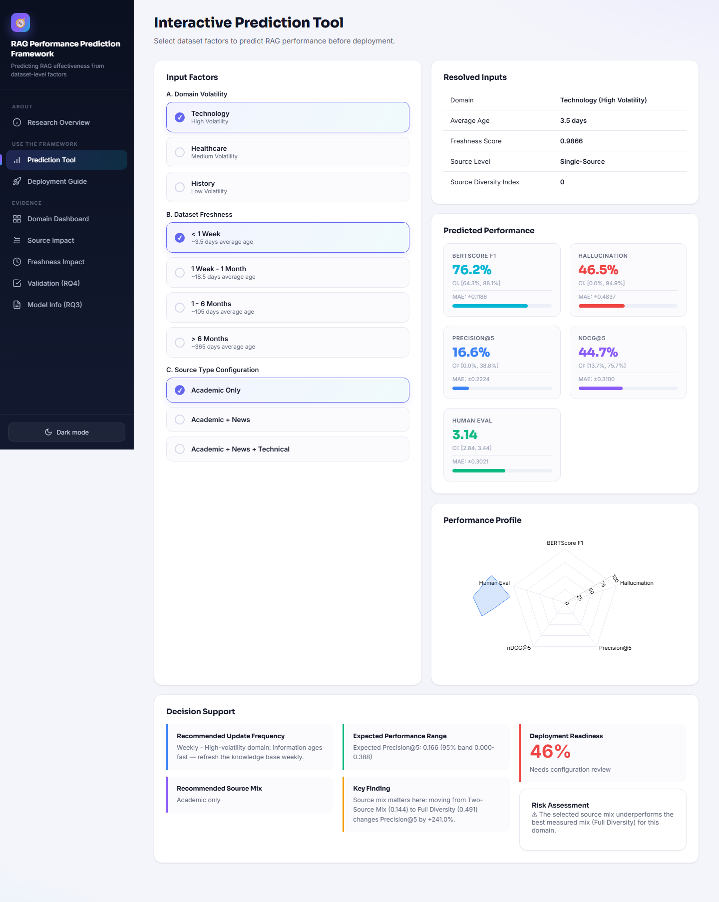
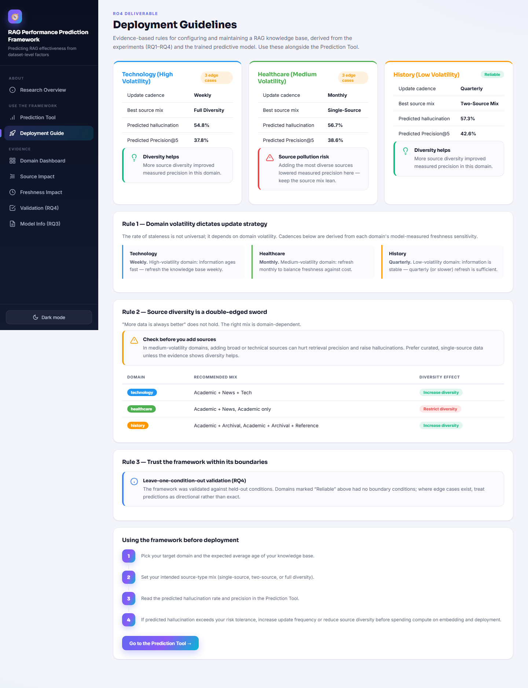
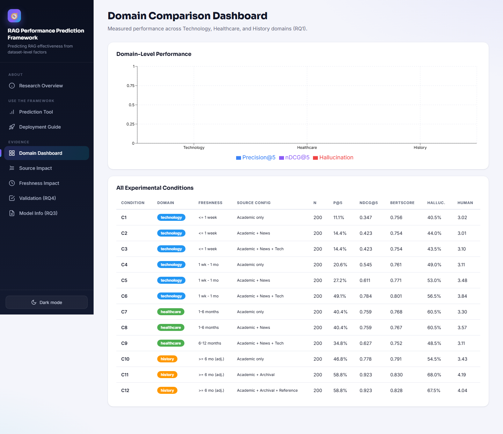
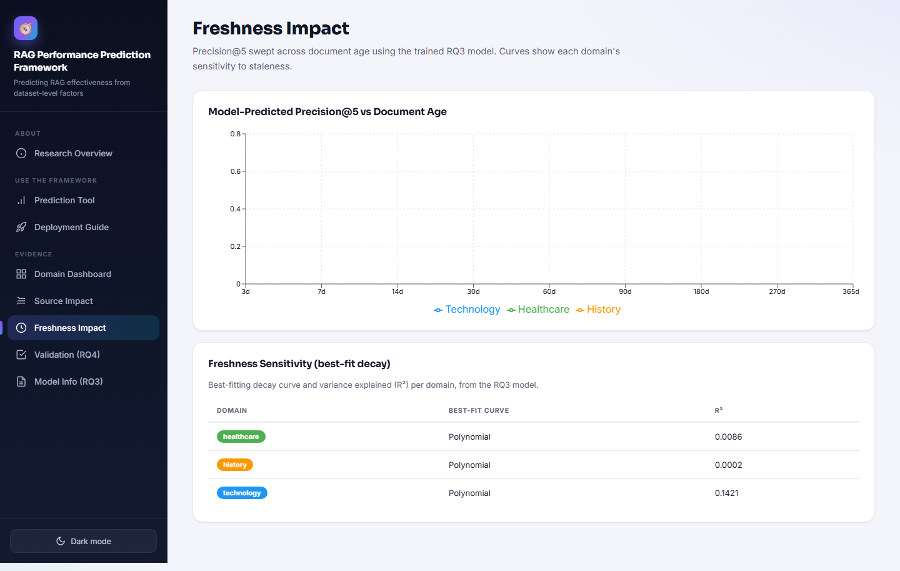
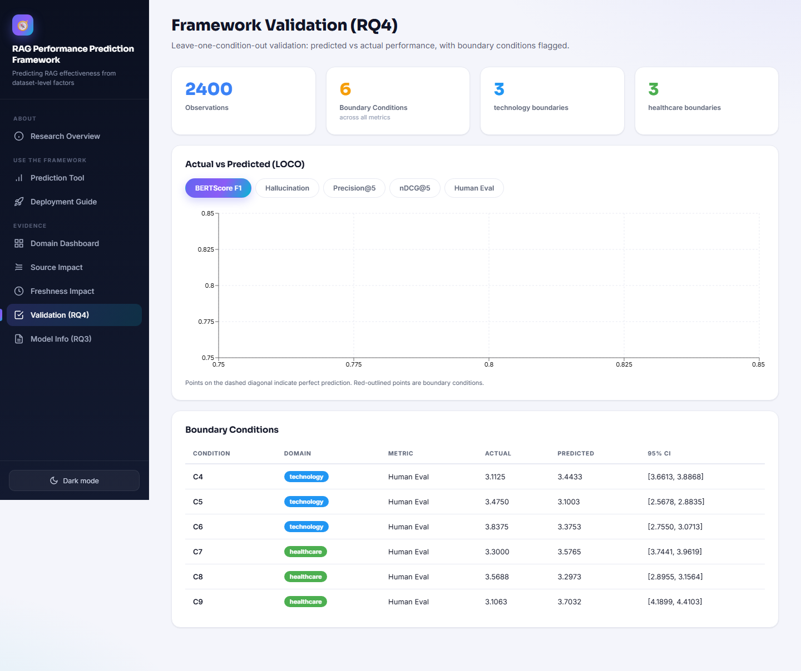

# RAG Performance Predictor

A standalone tool that predicts **Retrieval-Augmented Generation (RAG)** system
performance from dataset-level factors — **domain volatility**, **dataset freshness**,
and **source-type mix** — *before* deployment, and recommends a knowledge-base
configuration.

It packages the validated predictive model from the master's dissertation
*"A Framework for Predicting Retrieval-Augmented Generation System Performance Based on
Relevant Factors"* (Akashdeep Singh) into an interactive web app.

---

## Screenshots

| Research Overview | Prediction Tool |
|---|---|
|  |  |

| Deployment Guide | Domain Dashboard |
|---|---|
|  |  |

| Source Impact | Freshness Impact |
|---|---|
|  |  |

| Validation (RQ4) |
|---|
|  |

---

## What it does

Pick a domain, a freshness level, and a source mix, and the app returns:
- Predicted **Precision@5, nDCG@5, BERTScore, hallucination rate, human-eval score**,
  each with a cross-validated error band.
- A **deployment-readiness** score, recommended **update cadence** and **source mix**,
  **risks**, and an expected performance range — all computed from the data and the model.

It also surfaces the evidence: per-condition metrics, source/freshness impact, model
comparison, and validation / boundary conditions.

---

## Repository layout

```
rag-performance-predictor/
├── framework/           # the deployable app (FastAPI backend + React 19 frontend)
│   ├── backend/         # core/ (predictor, recommender) + data/ (bundled model & metrics)
│   ├── frontend/        # React + Vite + Recharts UI
│   └── README.md        # framework-specific docs
├── docs/
│   └── PROJECT_DEVELOPMENT_PLAN.md   # full end-to-end development report
└── screenshots/         # UI screenshots
```

---

## Quick start

```bash
cd framework

# Windows
run-windows.bat            # or:  powershell -ExecutionPolicy Bypass -File start.ps1

# Linux
chmod +x run-linux.sh && ./run-linux.sh

# macOS
chmod +x run-macos.sh && ./run-macos.sh
```

- Backend → http://localhost:8000 (API docs at `/docs`)
- Frontend → http://localhost:3000

See `framework/README.md` for the full API and architecture, and
`docs/PROJECT_DEVELOPMENT_PLAN.md` for how the data, experiments (RQ1–RQ4), and model
were built.

---

## Tech stack
FastAPI · React 19 · Vite · Recharts · scikit-learn / statsmodels (model training) ·
FAISS · sentence-transformers (all-MiniLM-L6-v2).

## License
Released for academic and research use.
